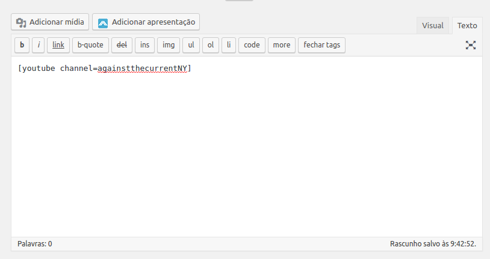
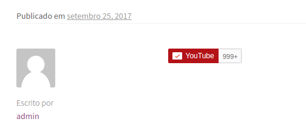

# My Youtube Subscribe Plugin

This is a sample of WordPress plugin to create Youtube subscribe button.

### Preview

### This is a test, don't use it!

Create `Shortcode` with plugin is not a hard work, you can basically do it by 1 function, `add_shortcode` (see the example in the `class/class-my_youtube_subscribe.php`).
 
### First parameter
The first parameter is your short code's name, for example:

`add_shortcode("youtube", "my_function");`, you can call it by `[youtube]`.

`add_shortcode("some_other_name", "my_function")`, you can call it by `[some_other_name]`.

### Second parameter
The second parameter is a function which your shortcode will render, you can return anything to be shortcode result.

